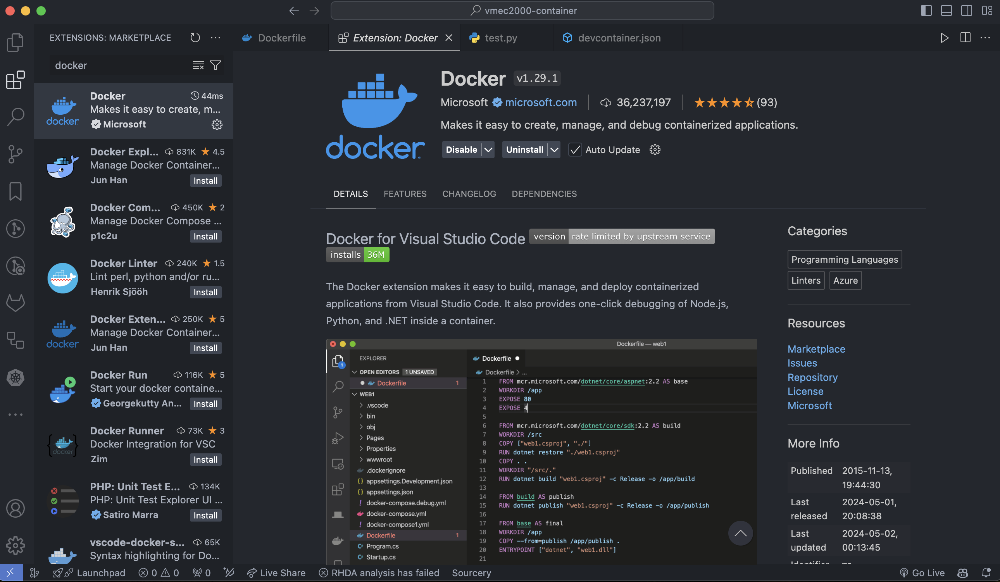
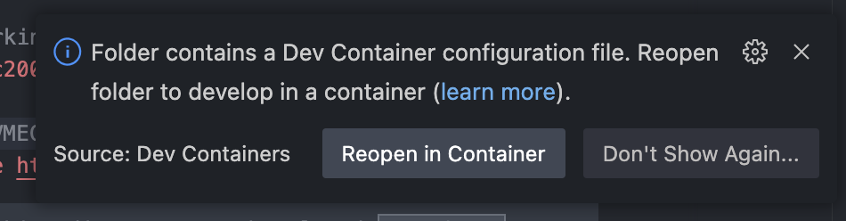
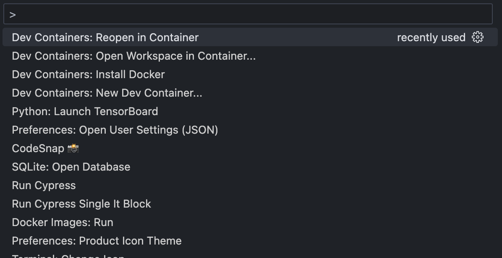
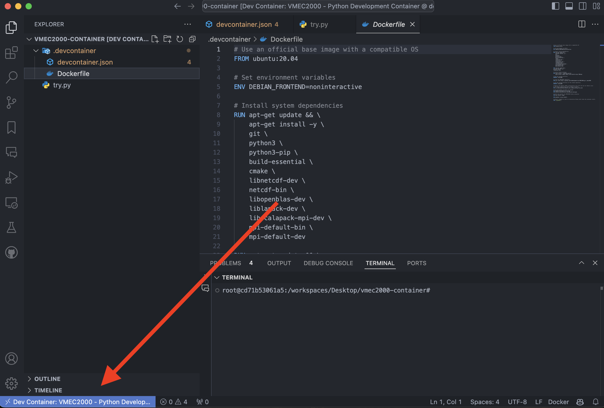

# VMEC2000 Dev Docker Container
## All those hours trying to install VMEC in your machine are over 🎉
Contains a dev-container directory with VMEC2000, streamlining its complex installation for easier project setup.

## Table of Contents
- [VMEC2000 Dev Docker Container](#vmec2000-dev-docker-container)
  - [All those hours trying to install VMEC in your machine are over 🎉](#all-those-hours-trying-to-install-vmec-in-your-machine-are-over-)
  - [Table of Contents](#table-of-contents)
  - [Description](#description)
  - [Installation](#installation)
  - [Details About the Container](#details-about-the-container)
  - [Contributing](#contributing)

## Description
A Development Docker Container 🚢 is something like a virtual machine, but it is much lighter and faster and you can use it 
as a "virtual environment" for your project. 

This container is based on the `ubuntu:20.04` image and the purpose of this container is to provide a simple 
way to have and use VMEC in your project. All those hours trying to install VMEC in your machine are over. We all know how painful it is 😢.

From now on, you just need to have Docker installed on your machine and you are good to go.


## Installation
1. Install Docker Desktop on Docker Website: [Docker Desktop](https://www.docker.com/products/docker-desktop). Docker Desktop needs to be running on your machine. On Mac, you can find the Docker icon in the top menu bar.
2. Copy the `.dev-container` directory to your project, that contains:
   
   ```
    .dev-container
    ├── Dockerfile
    └── devcontainer.json
    ```
3. Install the Docker extension in your VSCode: 

   

4. Now, when you open your project in VSCode, you will see a notification asking if you want to reopen the project in the container. 
   Click on the notification and wait for the container to be built. 
   If you don't see the notification, you can open the command palette and search for `Reopen in Container`:

   - Notification:
  
    
   
   - `Ctrl + Shift + P` (Windows/Linux) or `Cmd + Shift + P` (Mac) to open the command palette. Then:
  
    
5. You will be connected similiar to a remote connection. You are now inside the container and can modify the files in your project. When you disconnect, nothing will be lost. You are now ready to use VMEC in your project 🎉.

    


## Details About the Container

- **Base Image**: The container is built on the `ubuntu:20.04` image.

- **Configuration**: The `devcontainer.json` file specifies commands executed during container build and startup. Currently, it installs essential VSCode extensions and attempts to run the `requirements.txt` file from the project root, assuming a Python project. You can customize this file to include additional dependencies as needed.

- **Dockerfile**: The Dockerfile manages the installation of VMEC2000. While it provides a straightforward installation, you can modify it to suit your needs. You might consider using a lighter base image or adjusting the configuration to include pre-installed Python or other necessary dependencies.

- **Build Time**: The initial build of the container may take some time. Subsequent openings of the container will be faster as the build is cached.

- **Dependency Persistence**: Any dependencies installed within the container will be lost after the container is closed. To persist dependencies, you can add installation commands directly to the Dockerfile. For instance, you can include additional `RUN` commands before the `CMD` instruction in the Dockerfile, such as `RUN pip install pandas`. After updating the Dockerfile, rebuild the container to retain these dependencies in future sessions.

## Contributing
If you have any suggestions or improvements, feel free to open an issue or a pull request. We would love to hear from you! 🚀